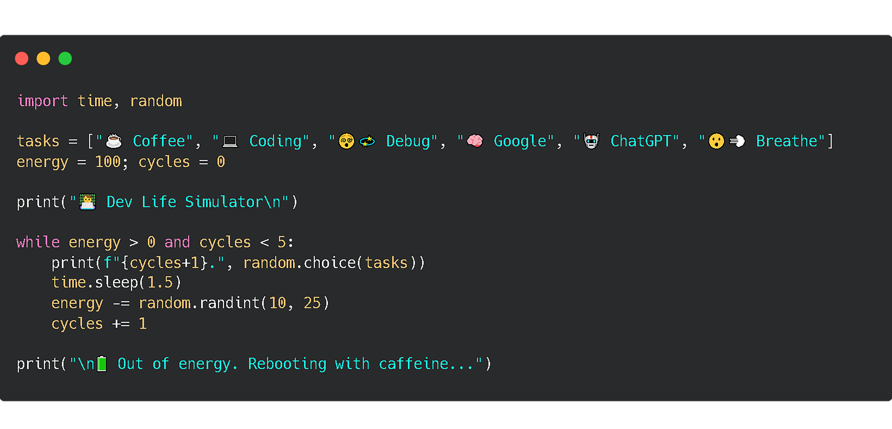

  

---

## 🤵 About Me

##### I am a software developer specializing in Python, a web developer with Html, Css, Js, and Python (Flask) Backend. Passionate about creating innovative and engaging websites, I strive to provide creative solutions and an engaging user experience.

---

## 🛠️ Tech Stack
   

##### 🧠 Python : Telegram Bot Created
#####  💼 Web Dev : Html, Css, Js & Python (Flask)

---

## 📈 GitHub Stats

  
  

---

## 🔗 Connect with Me
  

---

<picture>
  <source media="(prefers-color-scheme: dark)" srcset="https://raw.githubusercontent.com/ImamSr01/ImamSr01/output/pacman-contribution-graph-dark.svg">
  <source media="(prefers-color-scheme: light)" srcset="https://raw.githubusercontent.com/ImamSr01/ImamSr01/output/pacman-contribution-graph.svg">
  
</picture>

###

---
